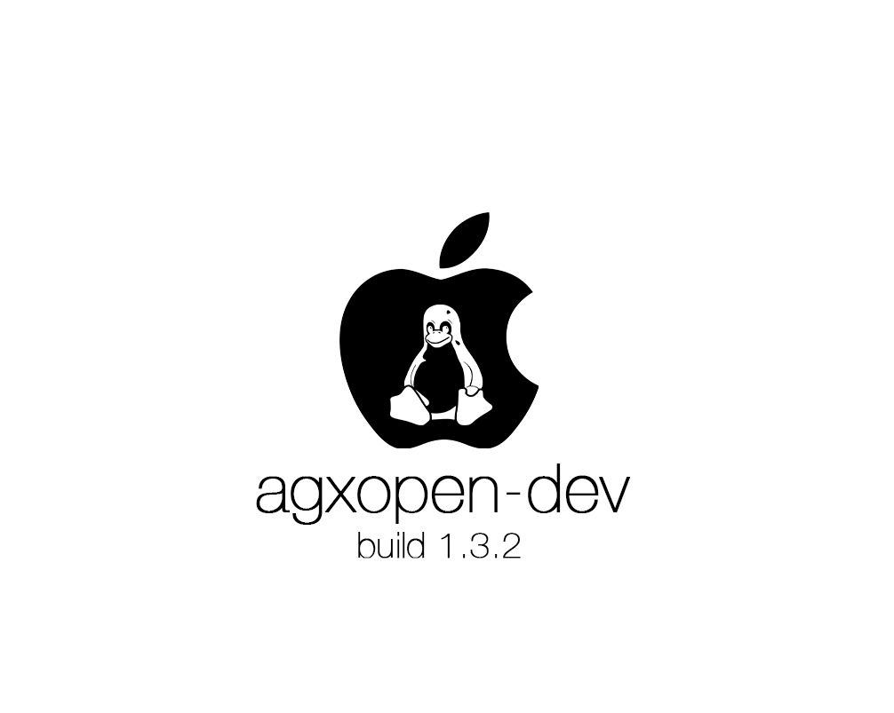

<p align="center">
  
</p>

<div align="center">

# agxopen-dev

**An open source RTBuddy mailbox client for the Apple M4 AGX GPU coprocessor**

agxopen-dev is still under development and in future WILL be working GPU driver for linux, i written asahi linux support hoping that some of it can eventually fit under `drivers/gpu/drm/asahi`.

<br>


</div>

---

## Purpose and stance

This project exists so that people who own Apple silicon Macs can one day run Linux on them with a fully open GPU stack. That is the whole goal of my project agxopen-dev

The work so far comes from static analysis and a simulator and no M4 machine has been available to me, only to testers. Please read every claim here as a starting point and not as a fact until someone has checked it on real hardware :)

What the project does and does not do:

| It does | It does not |
| --- | --- |
| Document the M4 GPU coprocessor mailbox and startup | Contain or redistribute any Apple source code |
| Provide an original Linux kernel module for that transport | Ship Apple firmware or kexts or kernelcaches or IDA databases or device trees |
| Compare findings against Asahi Linux m1n1 and mainline Linux rtkit | Modify or patch or run on macOS |
| Offer tests and host tools for inspection and tracing | Touch the display coprocessor protocol (out of scope) |

---

## At a glance

| | |
| --- | --- |
| **Project** | agxopendev with module name `agxrtbuddy` |
| **Version** | 0.1.0 alpha |
| **Maturity** | Early stage reverse engineering and not a finished driver |
| **Target hardware** | Apple M4 with GPU family AGX G16G (T8132) |
| **Analysed device** | Mac16,1 |
| **Kernelcache analysed** | `kernelcache.release.Mac16,1_2_3_10_12_13` from macOS build 24G90 (Darwin 24.6.0 and xnu 11417.140.69) |
| **Device tree source** | The public restore image of macOS build 26A428 and the board file for `j604ap` |
| **Analysis method** | Static analysis with IDA Pro and the Hex-Rays decompiler plus comparison with m1n1 and mainline Linux |
| **Kernel module language** | Plain C in kernel style |
| **Host tools and tests** | C++17 and small C files in userspace only |
| **Kconfig symbol** | `AGXOPEN_RTBUDDY` |
| **Kernel dependencies** | `ARCH_APPLE` or `COMPILE_TEST` |
| **Endpoints used** | Management `0` and system `1 2 3 4 8` and firmware `0x20` and doorbell `0x21` |
| **Device tree match** | `apple,t8132-gfx-asc` (provisional) |
| **Interrupt used** | `recv-not-empty` which is ADT index 2 and number 996 |
| **Debugfs root** | `/sys/kernel/debug/agxrtbuddy` |
| **Upstream target** | `drivers/gpu/drm/asahi` |
| **License** | GNU GPL version 2 and see [License](#license) |

---

## Table of contents

1. [Purpose and stance](#purpose-and-stance)
2. [At a glance](#at-a-glance)
3. [Architecture](#architecture)
4. [Findings](#findings)
5. [What is confirmed and what is not](#what-is-confirmed-and-what-is-not)
6. [Repository layout](#repository-layout)
7. [Getting started](#getting-started)
8. [Module design](#module-design)
9. [Host tools](#host-tools)
10. [Testing](#testing)
11. [Roadmap](#roadmap)
12. [Known limitations](#known-limitations)
13. [Reproducing the analysis](#reproducing-the-analysis)
14. [Contributing](#contributing)
15. [FAQ](#faq)
16. [License](#license)
17. [Acknowledgements](#acknowledgements)

---

## Architecture

The GPU on Apple silicon is driven through a dedicated coprocessor. The application processor talks to it through a hardware mailbox. On top of that mailbox sits the RTKit endpoint model. This repository covers the layers below and it also holds early groundwork for the memory side.

Layers from the top of the stack down to the hardware:

| Layer | Where | State |
| --- | --- | --- |
| Asahi GPU driver stack under `drivers/gpu/drm/asahi` | Not in this repo | The eventual consumer of everything below |
| GPU firmware structures such as init data and channels | Not in this repo | Not written and needs an M4 variant |
| GPU firmware and doorbell messages on endpoints `0x20` and `0x21` | This repo | Message values checked against the kernelcache |
| RTKit management endpoint `0` and the system endpoints | This repo | Own protocol core based on m1n1 and mainline Linux |
| ASC mailbox transport with 16 byte items | This repo | Grounded in decompiled code |
| ASC control block and mailbox in one register region | Hardware | Base address comes from the device tree |

The memory side sits next to this stack. The coprocessor reaches its shared buffers through the GPU page tables (UAT) and a handoff structure. The page table code and the handoff lock are written and tested but they are not connected to the boot path yet

The display coprocessor sits beside all of this and not inside it. It uses a different transport (AFK) on top of the same mailbox layer and it is out of scope here.

---

## Findings

Most of this section comes from decompiled function bodies and strings in the kernelcache. A few items come from the restore image device tree or from comparing with m1n1 and mainline Linux and those are marked. The longer write up with confidence levels lives in [`docs/findings.md`](docs/findings.md).

### One register region

Every register accessor in `AppleASCWrapV6` works from a single mapped base. The CPU control register and the whole mailbox are offsets from that same base. One device tree `reg` range has to cover both up to at least offset `0x8840`. The device tree of the `j604ap` board gives a first region of `0x88000` bytes so it fits with room to spare.

| Offset | Register | Notes |
| --- | --- | --- |
| `0x0040` | Idle control | Bit 0 must be set for the idle check to proceed but only when the device tree property `idle-ctrl-check` exists |
| `0x0044` | CPU control | Bit 4 (`0x10`) is the run bit |
| `0x0048` | Idle status | The coprocessor is idle when either of the two low bits is set |
| `0x8110` | Inbox control and status | Bit 0 KIC inbox enabled and bit 16 full and bit 17 empty and bits 18 and 19 underflow checked |
| `0x8114` | Outbox control and status | Bit 0 outbox enable and bit 17 empty and bits 18 and 19 underflow checked and bits 20 to 23 item count |
| `0x8800` | Inbox data 0 | AP writes the first half of an item |
| `0x8808` | Inbox data 1 | AP writes the second half of an item |
| `0x8830` | Outbox data 0 | AP reads the first half of an item |
| `0x8838` | Outbox data 1 | AP reads the second half of an item |

Each mailbox item is 16 bytes. This was confirmed directly since `AppleASCWrapV6::mailboxItemSize` returns the literal value 16.

The CPU control offset and the run bit are the same as in the earliest Asahi Linux GPU code for M1. That is a good sign that the control block itself has not changed.

### Status register bits

| Register | Bit | Meaning |
| --- | --- | --- |
| Inbox `0x8110` | 0 | KIC inbox enabled |
| Inbox `0x8110` | 16 | Inbox full |
| Inbox `0x8110` | 17 | Inbox empty |
| Inbox `0x8110` | 18 and 19 | Checked by an underflow test with mask `0xC0000` |
| Outbox `0x8114` | 0 | Outbox enable |
| Outbox `0x8114` | 17 | Outbox empty |
| Outbox `0x8114` | 18 and 19 | Checked by an underflow test with mask `0xC0000` |
| Outbox `0x8114` | 20 to 23 | Queued item count from 0 to 15 |

macOS also reads a remaining count from the upper half of the second outbox data word. Its bulk read stops when that field reads 1 and it clears the field before passing the item on. The Linux code here drains by the empty bit as mainline does and it keeps the upper half only as raw flags.

### Comparison with the existing Asahi Linux mailbox

The layout matches `drivers/mailbox/apple-mailbox.c` for the ASC mailbox variants used on M1 through M3. The relative offsets are identical and shifted by a flat `0x8000`. The shift is explained by the shared base above. The M4 wrapper addresses the mailbox at a fixed `0x8000` into one control region.

| Register | Asahi Linux (M1 to M3) | M4 AGX (this project) | Delta |
| --- | --- | --- | --- |
| Inbox control | `0x110` | `0x8110` | `0x8000` |
| Outbox control | `0x114` | `0x8114` | `0x8000` |
| Inbox data 0 | `0x800` | `0x8800` | `0x8000` |
| Inbox data 1 | `0x808` | `0x8808` | `0x8000` |
| Outbox data 0 | `0x830` | `0x8830` | `0x8000` |
| Outbox data 1 | `0x838` | `0x8838` | `0x8000` |

No new wire format was found. An earlier revision of this driver added `0x8000` on top of these offsets by mistake and that double offset is now fixed.

### Starting the coprocessor

The start routine in `AppleA7IOP::startCPUWithOptions` does a few things in a fixed order:

1. It enables power and activates the mapper
2. It enables the outbox by setting bit 0 of the outbox control register
3. It sets the run bit in the CPU control register

Step 2 is easy to miss. `_apInitializesMailboxes` returns 1 for this class so the AP really does set the outbox enable bit before the CPU starts. An earlier revision of this driver skipped it. The functions that enable and disable the inbox and outbox interrupts are empty stubs on this hardware so there are no interrupt enable registers to program.

The run bit write appears to be skipped when the device tree carries the property `cpu-ctrl-filtered`. That reading is an inference and the `gfx-asc` node does not have the property anyway.

IORVBAR is a 64 bit register in a second device memory region. The wrapper writes it with bit 0 set as a lock. It only matters when the AP loads firmware itself. The `bootFirmware` function contains a panic with the text "GFX firmware was not loaded by iBoot". So on this machine the firmware is already in place and the driver only needs to start the CPU.

Device tree properties read by the wrapper at initialisation are `nmi-ext-irq` and `ext-irq-reg-index` and `idle-ctrl-check`. The `gfx-asc` node has none of them.

### Interrupts

The `gfx-asc` node lists four interrupts in this order: 994 and 993 and 996 and 995. `AppleA7IOP::start` registers two handlers by interrupt index.

| ADT index | Number | Role |
| --- | --- | --- |
| 0 | 994 | Not used by `AppleA7IOP` |
| 1 | 993 | Inbox handler and this fits send empty |
| 2 | 996 | Outbox handler and this fits receive not empty |
| 3 | 995 | Not used by `AppleA7IOP` |

The four numbers are consecutive. Sorted they match the mainline binding order of send empty and send not empty and receive empty and receive not empty. The device tree node in this repo lists them sorted and the driver asks for `recv-not-empty` by name which resolves to 996. The mapping of the outbox handler to receive not empty is an inference from what the handler does. It still needs a check on hardware.

### Endpoint model

| Endpoint | Role | Evidence |
| --- | --- | --- |
| `0x20` | Firmware endpoint | Receives the message callback and a power state action and it is used for sending firmware messages and for polled receive |
| `0x21` | Doorbell endpoint | Stored with no callback and used only for sending asynchronous notes |

`AGXFirmwareKextRTBuddy::isFirmwareStarted` requires both endpoints to be matched. The module mirrors that rule. Both send paths refuse to send when a flag byte in the client object is set and the meaning of that flag is not known yet.

This matches the Asahi Linux GPU driver which uses `0x20` for init and incoming notifications and `0x21` for doorbells. The source uses the names firmware and doorbell.

### GPU firmware and doorbell messages

These values were read from the `AGXArmFirmware` class in the kernelcache. The first four match what m1n1 uses on M1 and M2.

| Message | Endpoint | Layout | Where |
| --- | --- | --- | --- |
| Init | `0x20` | Type `0x81` in the top bits and the 44 bit init data address in the low bits | `notifyFirmwareStarted` |
| Event from firmware | `0x20` | The type field masked with `0x3F` equals 2 which includes m1n1's `0x42` | `receivedMessageFromAKF` |
| Doorbell | `0x21` | Type `0x83` with the payload `(index and 7) shifted left by 2` | `kickFirmware` |
| Doorbell alternate | `0x21` | Same as above with type `0x86` when a flag argument is set | `kickFirmware` |
| Firmware control | `0x21` | Exactly `0x0084000000000000` with no payload | `blockForRingEmpty` |
| Stop | `0x21` | Type `0x85` with a 44 bit counter | `stopFirmwareForRecoveryInspection` |

The kick value `0x10` that m1n1 uses is index 4 under this formula. What the flag for type `0x86` means is not known. What the counter in the stop message means is also not known.

### RTKit management protocol

The management endpoint decodes its message type from bits 52 to 55. The numbering lines up with the Linux rtkit driver.

| Type | Meaning in macOS | Linux rtkit |
| --- | --- | --- |
| 1 | Hello | HELLO |
| 2 | Hello reply | HELLO_REPLY |
| 3 | Watchdog ping | Not implemented |
| 4 | Ping acknowledge | Not implemented |
| 5 | Not observed in this pass | STARTEP |
| 6 | Set IOP power state | SET_IOP_PWR_STATE |
| 7 | IOP power acknowledge | SET_IOP_PWR_STATE_ACK |
| 8 | Endpoint roll call | EPMAP and EPMAP_REPLY |
| `0xB` | AP power state | SET_AP_PWR_STATE and its ACK |
| `0xC` | Sets a flag and notifies the owner | No equivalent |

Hello messages carry the protocol version range in the low 32 bits and two flag bits at bits 32 and 33 with one reflecting whether debugging is permitted. The driver picks the lower of the firmware maximum and 12 and refuses anything below 11. The roll call reports 32 endpoints per message as a bitmap and that is the same scheme Linux uses.

The message layouts the driver actually uses come from mainline Linux `rtkit.c` and m1n1 `mgmt.py` and not from the M4 binary. The start endpoint message is the main example because type 5 was not decompiled here.

### Power states

The power state request function sends one of four fixed type 6 messages from a table in the binary.

| Index | State value | Linux rtkit name |
| --- | --- | --- |
| 0 | `0x201` | IDLE |
| 1 | `0x220` | INIT |
| 2 | `0x202` | Not present in Linux |
| 3 | `0x000` | OFF |

The Linux driver defines IDLE as `0x201` and QUIESCED as `0x10` and ON as `0x20` and INIT as `0x220`. Every value except `0x202` already exists there. The wire values now live in `include/agx/power.h`. A separate software enum with four states maps from them and a value that does not map is reported as unknown. The state `0x202` stays unexplained.

### Memory and page tables

The coprocessor does not sit behind a normal DART. The device tree node has an `iommu-parent` that points at a node with the compatible `iommu-mapper,gfx`. The kernel asks the mapper for 16 KB aligned addresses through `AppleA7IOP::_dartMapMemoryDescriptor`. Shared buffers for the coprocessor are allocated through `rtbuddy_allocate_shared_memory_buffer` and the kernel hands the firmware the device visible address.

The GPU page tables (UAT) live in `AGXUnifiedAddressTranslator`. The panic strings in `updatePageTableEntry` and `clearPageTableEntry` spell out the walk:

| Level | Address bits | Entries |
| --- | --- | --- |
| Table select | Bit 42 picks between two top level tables | 2 |
| Page catalogue | Bits 36 to 41 | 64 |
| Page directory | Bits 25 to 35 | 2048 |
| Page table | Bits 14 to 24 | 2048 |
| Page | 16 KB | Not applicable |

This matches the layout m1n1 uses for GPU generation G15 and newer. The handoff structure carries the magic value `0x4B1D000000000002` which `initHandoff` writes as a literal. The AP and the firmware share a lock in that structure and the layout of it follows m1n1 `handoff.py`.

The kernel reads these runtime properties from the `sgx` node:

| Property | Region label in the binary |
| --- | --- |
| `gfx-shared-region-base` and `gfx-shared-region-size` | TTBR1 shared region |
| `gfx-shared-l2-region-base` | TTBR1 shared L2 table |
| `gpu-region-base` | TTBAT which is the table of TTBR pairs |
| `gfx-handoff-base` | GPU handoff region |

A separate ASC carveout region comes from the chosen carveout memory map. None of these values are in the restore image device tree because iBoot fills them in at boot. The property `rtkit-private-vm-region-base` that m1n1 uses on M1 to M3 does not appear anywhere in this kernelcache. What replaces it is not known.

### Device tree facts

These come from the restore image device tree of build 26A428 for the `j604ap` board. The raw addresses are offsets and the physical address is the raw value plus `0x200000000`. That offset was checked against two `pmgr` regions and both matched the Asahi tree.

| Property of `gfx-asc` | Value |
| --- | --- |
| Compatible | `iop,ascwrap-v6` |
| First region | Raw `0x102600000` and size `0x88000` so physical `0x302600000` |
| Second region | Raw `0x102050000` and size `0x8` and this is the IORVBAR register |
| Interrupts | 994 and 993 and 996 and 995 |
| Power and clock gate | Index 315 which the device tree lists as an alias of domain 55 |
| Child node | `iop-gfx-nub` with compatible `iop-nub,rtbuddy-v2` |

The node in `dts/t8132-gfx-asc.dtsi` uses these values with the power domain `ps_gfx` from the Asahi M4 tree. That power domain choice is a guess. The file compiles together with the Asahi `t8132.dtsi` and `t8132-pmgr.dtsi` and that only shows the references resolve.

### Class hierarchy

| Class | Role |
| --- | --- |
| `RTBuddyService` | Extends `IOService` and owns firmware loading and endpoint matching |
| `RTBuddyEndpoint` | Extends `IOSlaveEndpoint` and owns per endpoint message queueing |
| `RTBuddyEndpointService` | Extends `IOService` and represents a matched endpoint as an IOKit nub |
| `RTBuddyManagementEndpoint` | Owns the management protocol of hello and roll call and power and ping and watchdog |
| `RTBuddy` | Separate from `RTBuddyService` and owns hardware polling and mailbox posting |
| `AppleA7IOP` | Generic ASC driver that registers the interrupts and starts the CPU |
| `AppleASCWrapV6` | Lowest hardware layer and derives from `AppleA7IOP` and is shared by several coprocessors |
| `AGXFirmwareKextRTBuddy` | GPU specific RTBuddy client that registers the two endpoints |
| `AGXArmFirmware` | Builds and sends the init and doorbell messages |
| `AGXUnifiedAddressTranslator` | Owns the GPU page tables and the handoff structure |

### Power coordination with the display coprocessor

`AppleDCPExpert` is the display coprocessor expert class. It shares the `RTBuddyPowerState` type used by the GPU RTBuddy client and it exposes a callback mechanism through `DCPPowerCallback` objects. The GPU and display coprocessors therefore coordinate power transitions through a common state type. The display module in this project only mirrors the callback broker pattern in software.

### Secure monitor notes

Earlier work looked at the secure page table monitor and the TXM. The notes are in [`docs/sptm-findings.md`](docs/sptm-findings.md) and [`docs/txm-findings.md`](docs/txm-findings.md) and the matching headers are in `include/agx`. Asahi Linux reports early boot progress on M4 through a path that does not load the monitor. If that holds then these notes matter mostly for tracing macOS and not for the Linux driver. That has not been confirmed here.

---

## What is confirmed and what is not

 means grounded in decompiled code or data in the binary or in the device tree.  means it follows from confirmed facts but was not observed directly.  means taken from m1n1 or mainline Linux and not checked against M4.  means not analysed or not known.

| Area | Status | Notes |
| --- | --- | --- |
| Mailbox register offsets |  | Six offsets read from `AppleASCWrapV6` |
| Mailbox item size of 16 bytes |  | Literal return value |
| Status bit meanings |  | Full and empty and count and enable and underflow bits |
| Single shared register base |  | CPU control and mailbox use the same base pointer |
| CPU control at `0x44` with run bit 4 |  | Same as the earliest Asahi GPU code on M1 |
| Outbox enable before the run bit |  | `startCPUWithOptions` and `_enableOutbox` |
| Interrupt enable functions are stubs |  | Eight byte functions in `AppleASCWrapV6` |
| Outbox handler on interrupt index 2 |  | `AppleA7IOP::start` |
| Index 2 means receive not empty |  | Follows from what the handler does and from the number pattern |
| Firmware loaded by iBoot |  | Panic text in `bootFirmware` |
| Endpoint `0x20` firmware role |  | Callback and send path both use it |
| Endpoint `0x21` doorbell role |  | Stored without callback and send only |
| Init and event and doorbell and firmware control messages |  | Values and layouts read from `AGXArmFirmware` |
| Stop message `0x85` layout |  | Type and 44 bit counter |
| Management message numbering |  | Types 1 and 2 and 4 and 6 and 7 and 8 and `0xB` decoded and matched to Linux |
| Power state values |  | Four values from the binary's own table |
| UAT level shifts and table select bit |  | Panic strings in `AGXUnifiedAddressTranslator` |
| Handoff magic value |  | Literal in `initHandoff` |
| Runtime UAT property names |  | Strings next to the region labels |
| `rtkit-private-vm-region-base` unused |  | The string is absent from the kernelcache |
| Physical address offset `0x200000000` |  | Two data points that both matched |
| `RTBuddyPowerState` enum ordering |  | Suggested by two functions agreeing on indices 0 and 3 |
| Count bits in outbox data word |  | Consistent with the bulk read logic |
| Boot order and start endpoint message |  | From mainline Linux and m1n1 and type 5 not decompiled |
| Shared buffer request layouts |  | From mainline Linux |
| PTE and TTBR bit positions |  | m1n1 values for older chips |
| Power domain `ps_gfx` for the coprocessor |  | A guess from a domain alias |
| Doorbell flag for type `0x86` |  | Meaning unknown |
| Stop message counter meaning |  | Meaning unknown |
| Power state `0x202` |  | Not present in Linux rtkit |
| Management type `0xC` |  | Sets a flag and the purpose is unknown |
| Management type 5 in the binary |  | Not decompiled yet |
| Mapping for the coprocessor buffers on M4 |  | Design and address window unknown |
| Live values of the UAT properties |  | Need a device tree dump from an M4 |
| Display coprocessor (AFK) transport |  | Classes located and not decompiled and out of scope |
| Real hardware bring up |  | Depends on the wider Asahi Linux effort |

---

## Repository layout

| Path | Purpose |
| --- | --- |
| `Makefile` | Out of tree kernel module build plus test and tools entry points |
| `Kconfig` | `AGXOPEN_RTBUDDY` entry for in tree integration |
| `LICENSE` | GPL notice |
| `README.md` | This file |
| `dts/t8132-gfx-asc.dtsi` | Device tree node for the coprocessor |
| `include/agx/types.h` | Fixed width types and status codes and small helpers |
| `include/agx/power.h` | Power state wire values and the software enum |
| `include/agx/mailbox_regs.h` | Mailbox register offsets and message helpers |
| `include/agx/rtkit.h` | RTKit management protocol core |
| `include/agx/gpu_ep.h` | GPU firmware and doorbell message encoders |
| `include/agx/uat.h` | UAT page table geometry and PTE and TTBR encoding and handoff layout |
| `include/agx/sptm*.h` and `txm.h` | Secure monitor and TXM addresses and layouts |
| `src/probe.c` | Platform driver probe and remove |
| `src/rtbuddy.c` | Coprocessor start and boot sequence and interrupt thread |
| `src/rtkit.c` | RTKit protocol core and it is also built in userspace for tests |
| `src/mailbox.c` | Mailbox register access |
| `src/power.c` | Power state helpers |
| `src/display.c` | Power transition callback broker |
| `src/debugfs.c` | Debugfs files for power and endpoints and rtkit state |
| `src/uat.c` | UAT page table walker with lazy table allocation |
| `src/gfxhandoff.c` | Lock and flush protocol with the coprocessor |
| `src/*.h` | Kernel only headers that stay private to the module |
| `docs/` | Findings and todo and secure monitor notes |
| `tools/` | Host tools and see [Host tools](#host-tools) |
| `tests/` | Test suites and a small kernel API shim and see [Testing](#testing) |

All headers under `include/agx` build as C99 and later and as C++11 and later. The four kernel headers that hold mutexes and wait queues stay in `src` because they cannot be included from userspace.

---

## Getting started

### Requirements

| For | You need |
| --- | --- |
| Kernel module | A kernel build tree or headers and a C toolchain and `make` |
| Host tools and tests | `gcc` and `g++` with C++17 and `make` |
| Sanitizer runs | A `gcc` with AddressSanitizer and UndefinedBehaviorSanitizer and ThreadSanitizer |
| Devicetree check | `dtc` and `cpp` plus the Asahi `t8132.dtsi` and `t8132-pmgr.dtsi` |
| Running the module | An M4 machine running a kernel that can bring up the platform and see [Roadmap](#roadmap) |

The tests and tools need no kernel tree and no hardware and they build on any Linux host.

### Build the kernel module

The module is an out of tree module for development. It builds against the running kernel by default. Point `KDIR` at another kernel build tree if needed.

```sh
make
make KDIR=/path/to/kernel/build
```

Other module targets:

```sh
make clean
make install
```

The module builds with `W=1` and `-Werror` against Ubuntu kernel headers for 6.8 and 7.0 on ARM64

### Build the host tools

```sh
make tools
```

This produces `agxmonitor` and `agxtracedump` and `agxtracereplay` in `tools/`.

### Run the tests

```sh
make test
make -C tests sanitize
```

The first command builds and runs every suite. The second runs the driver harness and the register and page table suite under AddressSanitizer with UndefinedBehaviorSanitizer and then under ThreadSanitizer. No kernel build and no hardware are needed.

### Load the module

```sh
sudo insmod ./agxrtbuddy.ko
sudo dmesg | tail
```

The driver binds to a node that matches `apple,t8132-gfx-asc`. It needs the first `reg` region to be at least `0x8840` bytes and an interrupt named `recv-not-empty` and a power domain. On a successful boot sequence the log reports that both endpoints are up.

### Device tree

The node in `dts/t8132-gfx-asc.dtsi` carries these properties:

| Property | Value |
| --- | --- |
| `compatible` | `apple,t8132-gfx-asc` |
| `reg` | The coprocessor region at physical `0x302600000` with size `0x88000` and the IORVBAR region at `0x302050000` with size `0x8` |
| `reg-names` | `asc` and `rvbar` |
| `interrupt-parent` | The AIC node |
| `interrupts` | 993 and 994 and 995 and 996 all level high |
| `interrupt-names` | `send-empty` and `send-not-empty` and `recv-empty` and `recv-not-empty` |
| `power-domains` | `ps_gfx` |

The compatible string and the power domain are provisional. The three UAT regions are not in the node yet. Asahi declares them as reserved memory nodes named `uat-ttbs` and `uat-pagetables` and `uat-handoff` and has m1n1 fill in the addresses at boot. The M4 tree has none of that yet.

---

## Module design

| File | Responsibility |
| --- | --- |
| `src/mailbox.c` | Lock protected accessors over the mailbox registers. Send polls the inbox full bit with a 100 millisecond limit and returns a timeout error if it never clears. Receive reads both outbox words in order. Setting the outbox enable bit lives here too |
| `src/rtkit.c` | The RTKit protocol core with no kernel dependencies. It handles hello with version negotiation and the endpoint roll call and starts the system endpoints and answers buffer requests and tracks both power acknowledgements |
| `src/rtbuddy.c` | Owns the boot sequence and the threaded interrupt handler and the shared buffers and the GPU message senders |
| `src/probe.c` | Platform driver glue. Maps the first region and checks its size and takes the named interrupt and enables the power domain and boots and registers debugfs |
| `src/power.c` | Maps wire power values to the software enum and to readable names |
| `src/display.c` | A small listener list that mirrors the power callback broker pattern of the display coprocessor expert. It does not implement any display protocol |
| `src/debugfs.c` | Exposes live state without a debugger |
| `src/uat.c` | Page table walker with lazy allocation and a software tree of host pointers next to the hardware tables. Not connected to the boot path yet |
| `src/gfxhandoff.c` | Lock and cache flush and unmap requests over the handoff structure with hooks for memory barriers. Not connected to the boot path yet |

### Boot sequence

1. Set the outbox enable bit
2. Set the CPU run bit
3. Send the IOP power state INIT (`0x220`)
4. Register the threaded interrupt handler
5. Wait for hello and the endpoint roll call and let the core start the system endpoints and answer their buffer requests
6. Wait for the IOP acknowledgement and check that the state reads as on
7. Send the AP power state on (`0x20`) and wait for its acknowledgement
8. Start endpoints `0x20` and `0x21`
9. Report the power state as on

Each wait stage has a 500 millisecond limit. A failure stops the CPU again and the error goes back to the caller. Shutdown quiesces the AP power state and then sends the IOP to sleep and frees the interrupt and stops the CPU and frees the buffers.

The interrupt handler is registered after the INIT message on purpose. Otherwise the reply to the first hello can race ahead of INIT on the wire. m1n1 always sends INIT first.

### Message layout used by the module

| Word | Contents |
| --- | --- |
| Data 0 | 64 bit message payload passed to the endpoint untouched |
| Data 1 | Endpoint number in the low 8 bits and the rest kept as raw flags |

### Debugfs interface

Root directory: `/sys/kernel/debug/agxrtbuddy`

| File | Mode | Contents |
| --- | --- | --- |
| `power` | read only | Software power state name which is `off` or `quiescent` or `standby` or `on` |
| `endpoints` | read only | Firmware and doorbell endpoint state and counters for firmware events and other messages |
| `rtkit` | read only | Protocol version and both power values and error and crash state and message counters and the last unknown message |
| `draincount` | read only | Total number of mailbox messages drained by the interrupt thread |

---

## Host tools

All host tools are C++17 and run entirely in userspace. They never touch the kernel module directly.

### agxmonitor

A live terminal monitor. It reads the debugfs files above and refreshes once a second. Press Control C to quit. If a value cannot be read it prints `unavailable`.

Example output with illustrative values:

```
agx rtbuddy live monitor

power state    on
drain count    42

firmware 0x20 up 1
doorbell 0x21 up 1
firmware events 0
other app messages 0

version 12
iop power 0x20
ap power 0x20
running 1
crashed 0
error 0
rx 31
stray 0
unknown 0
last unknown 0x0000000000000000

refreshing every second, press control c to quit
```

### Trace format

A small binary format defined in `tools/trace/agxtrace.hpp` for recording mailbox traffic.

| Part | Size | Description |
| --- | --- | --- |
| Header magic | 8 bytes | The bytes `agxtrc1` followed by a zero byte |
| Record | 24 bytes each | Repeated until end of file |

Record fields in order:

| Field | Type | Description |
| --- | --- | --- |
| `timestampns` | `uint64` | Timestamp in nanoseconds |
| `endpoint` | `uint32` | Endpoint number |
| `flags` | `uint32` | Upper half of the second mailbox word |
| `data0` | `uint64` | Message payload |

Records are stored in host byte order. Only the reader side exists so a trace producer still needs to be written.

### agxtracedump

Prints a trace as a table with `timestampns` and `endpoint` and `flags` and `data0` columns followed by a record count.

```sh
./tools/agxtracedump capture.agxtrc
```

### agxtracereplay

Walks a trace and validates it. It counts messages for the management endpoint and the system endpoints and the firmware endpoint and the doorbell endpoint. It flags two anomalies which are a timestamp that goes backwards and an endpoint that is none of those. The exit status is `0` for a clean trace and `1` when an anomaly was found so it works in scripts and continuous integration.

```sh
./tools/agxtracereplay capture.agxtrc
```

---

## Testing

Everything here runs on a normal Linux host. The tests show that the code matches the model of the hardware used here. They do not show that the hardware behaves that way.

| Suite | Checks | What it covers |
| --- | --- | --- |
| Header builds | 7 | Every public header compiles under C99 and C11 and C17 and C++11 and C++14 and C++17 and C++20 with strict warnings |
| Protocol simulator | 50 | The RTKit core against a simulated firmware including version negotiation and the endpoint roll call and system endpoints and buffer requests and failure paths and a fuzz run |
| Registers and memory | 223 | Mailbox helpers and power mapping and GPU messages and PTE encoding and the page table walker with a fuzz run against a reference map and the handoff lock against a separately written mirrored firmware side on a second thread |
| Driver harness | 81 | The real mailbox and rtbuddy and display sources built against a small kernel API shim and a fake coprocessor with its own firmware thread and interrupt thread |

The driver harness covers the boot order and teardown and timeouts and a stuck mailbox and a firmware crash and GPU messages and 800 concurrent doorbells and 25 boot and remove cycles. The fake coprocessor also enforces the outbox enable bit. Removing that step from a scratch copy made the harness fail so the check does bite.

```sh
make test
make -C tests sanitize
```

All suites are clean under AddressSanitizer and UndefinedBehaviorSanitizer and ThreadSanitizer. The threaded suites were also repeated 25 to 40 times each without a failure.

The fake firmware was written from mainline Linux and m1n1 behaviour. If either one was misread then the tests will agree with the mistake.

---

## Roadmap

| Item | Status | Detail |
| --- | --- | --- |
| Mailbox transport |  | Register layout and item size and bit fields and drain logic |
| Endpoint roles and names |  | `0x20` firmware and `0x21` doorbell in source and tools |
| CPU start and outbox enable |  | Run bit and the enable step from `startCPUWithOptions` |
| RTKit core |  | Hello and roll call and system endpoints and buffer requests and power acknowledgements |
| Interrupt identification |  | Outbox handler is ADT index 2 and number 996 |
| GPU firmware and doorbell messages |  | Encoders and driver calls with values from the kernelcache |
| Device tree node |  | Compiles against the Asahi M4 files and still provisional |
| UAT page tables and handoff lock |  | Written and tested and not connected yet |
| Test suites and sanitizer runs |  | See [Testing](#testing) |
| Connect UAT to the boot path |  | Needs the live UAT addresses and a plan for choosing buffer addresses |
| Live device tree values |  | Ask someone with an M4 for the `sgx` properties and the carveout map |
| Buffer mapping on M4 |  | Replace `dma_alloc_coherent` with a mapping that goes through the GPU page tables |
| Management protocol gaps |  | Type 5 and type `0xC` and hello flags and power state `0x202` |
| Meaning of the doorbell flag and the stop counter |  | Trace how callers use them |
| Shared buffer contents |  | Read the syslog and decode crash logs |
| Display coprocessor transport |  | Decompile the AFK classes and compare with `drivers/gpu/drm/apple/dcp` |
| Arm64 kernel build |  | Compile against an Asahi tree and review against `rtkit.c` and `apple-mailbox.c` |
| Firmware structures for M4 |  | Init data and channel layouts are versioned per GPU generation so M4 needs its own variant and this is the largest piece of work |
| Real hardware bring up |  | Depends on the wider Asahi Linux effort and the m1n1 project shows current status |

The detailed list is in [`docs/todo.md`](docs/todo.md).

---

## Known limitations

It's still under development! and these are the limits known so far.

1. All was ran on hardware and it BARELY works (tested by testers not by me). The module compiles against x86_64 kernel headers for 6.8 and 7.0
2. The shared buffers still use `dma_alloc_coherent`.
3. The UAT code and the handoff lock are not connected to the boot path. They need addresses from a live device tree and a rule for choosing buffer addresses
4. The PTE and TTBR bit positions come from m1n1 and were not checked against the M4 binary. Only the level shifts and the handoff magic were
5. The kernelcache is from macOS build 24G90 and the device tree is from a newer restore image. Hardware facts should carry over. Details of the GPU firmware interface might not.
6. The interrupt for receive not empty is an inference. If nothing arrives on 996 then the neighbouring numbers are the first thing to try.
7. The boot order and the message layouts for start endpoint and buffer requests come from mainline Linux and m1n1 and were not read from the M4 binary.
8. The power domain `ps_gfx` and the compatible string are provisional.
9. The meaning of the doorbell flag for type `0x86` and of the stop counter is not known.
10. Nothing above the doorbell and firmware messages exists yet. There are no init data structures and no channels and no command submission.
11. The trace format has readers and no writer.
12. The tests use a fake coprocessor written for this project so they cannot find mistakes in the understanding of the real one

---

## Reproducing the analysis

Anyone can reproduce or extend the findings if someone want to help. The repository ships none of the analysed binaries so you supply your own copies from a macOS installation you are entitled to use

| Item | Value |
| --- | --- |
| Device | Mac16,1 |
| Kernelcache build | 24G90 |
| Kernelcache | `kernelcache.release.Mac16,1_2_3_10_12_13` |
| Kernel version string | Darwin 24.6.0 and xnu 11417.140.69 for `RELEASE_ARM64_T8132` |
| Device tree build | 26A428 |
| Device tree file | `DeviceTree.j604ap.im4p` from the public restore image |
| Tools i used: | IDA Pro and the `ipsw` tool for the device tree |

The device tree can be fetched without downloading the whole image (little help from me):

```sh
ipsw download ipsw --macos --device Mac16,1 --latest --pattern DeviceTree
ipsw dtree DeviceTree.j604ap.im4p > adt.txt
```

The kernelcache carries symbol names so the functions below can be found by name. Addresses apply to this exact build only.

| Symbol | Address | What it settled |
| --- | --- | --- |
| `AGXFirmwareKextRTBuddy::matchedGFXEndpointGated` | `0xfffffe00090b9c34` | Which endpoint gets the callback |
| `AGXFirmwareKextRTBuddy::sendMessageToFirmwareGated` | `0xfffffe00090b92cc` | Firmware messages go out on `0x20` |
| `AGXFirmwareKextRTBuddy::sendAsyncNoteToFirmwareGated` | `0xfffffe00090b8f50` | Asynchronous notes go out on `0x21` |
| `AGXFirmwareKextRTBuddy::isFirmwareStarted` | `0xfffffe00090b94b4` | Both endpoints must be matched |
| `AGXFirmwareKextRTBuddy::bootFirmware` | `0xfffffe00090b94d8` | Firmware is loaded by iBoot |
| `AGXArmFirmware::notifyFirmwareStarted` | `0xfffffe000910f1e0` | The init message |
| `AGXArmFirmware::receivedMessageFromAKF` | `0xfffffe000910f5f0` | The event type check |
| `AGXArmFirmware::kickFirmware` | `0xfffffe0009123608` | The doorbell message |
| `AGXArmFirmware::blockForRingEmpty` | Contains `0xfffffe0009121fc0` | The firmware control message |
| `AGXArmFirmware::stopFirmwareForRecoveryInspection` | Contains `0xfffffe00091245d8` | The stop message |
| `AppleA7IOP::start` | `0xfffffe00091907c8` | Interrupt handler indices |
| `AppleA7IOP::startCPUWithOptions` | `0xfffffe00091914e0` | Start order and the outbox enable |
| `AppleA7IOP::_apInitializesMailboxes` | `0xfffffe0009192d84` | Returns 1 |
| `AppleA7IOP::_dartMapMemoryDescriptor` | `0xfffffe0009191f2c` | 16 KB aligned mapping through the mapper |
| `_rtbuddy_allocate_shared_memory_buffer` | `0xfffffe0009970708` | Buffers come from the slave memory allocator |
| `AppleASCWrapV6::_runCPU` | `0xfffffe000918e3dc` | CPU control at `0x44` and run bit 4 |
| `AppleASCWrapV6::_enableOutbox` | `0xfffffe000918e898` | Outbox enable bit |
| `AppleASCWrapV6::_isIdle` | `0xfffffe000918e32c` | Idle status and the `idle-ctrl-check` gate |
| `AppleASCWrapV6::_setIORVBAR` | `0xfffffe000918e0ec` | IORVBAR write with lock bit |
| `AppleASCWrapV6::_mapFirmware` | `0xfffffe000918e124` | The two firmware mapping paths |
| `AppleASCWrapV6::initialize` | `0xfffffe000918dd50` | Device tree properties read at init |
| `AppleASCWrapV6::getMailboxBulk` | `0xfffffe000918e5c4` | Drain loop and the count bits |
| `AppleASCWrapV6::mailboxItemSize` | `0xfffffe000918ead8` | The 16 byte item size |
| `AGXUnifiedAddressTranslator::updatePageTableEntry` | `0xfffffe000917ec08` | Level shifts and index widths |
| `AGXUnifiedAddressTranslator::clearPageTableEntry` | `0xfffffe000917eacc` | Same walk for unmapping |
| `AGXUnifiedAddressTranslator::initHandoff` | `0xfffffe0009181fa4` | Handoff magic and layout |
| `AGXUnifiedAddressTranslator::allocateGart` | `0xfffffe0009181310` | Table allocation and the handoff mapping |
| `RTBuddyManagementEndpoint::_messageHandler` | `0xfffffe000b83ed24` | Management message dispatch |
| `RTBuddyManagementEndpoint::_buildHelloMsg` | `0xfffffe000b840074` | Hello layout and flag bits |
| `RTBuddyManagementEndpoint::_buildRollCall` | `0xfffffe000b8400e0` | Roll call bitmap |
| `RTBuddyManagementEndpoint::_signalApPowerGated` | `0xfffffe000b83f368` | AP power state mapping |
| `RTBuddyManagementEndpoint::requestPowerState` | `0xfffffe000b83f6e0` | The four entry power message table |

A plain list of symbol names from the analysed build may accompany the analysis as a navigation aid and it contains names only.

---

## Contributing

Contributions are welcome and especially from people who own M4 hardware or who can decompile the areas listed in the [Roadmap](#roadmap).

**Ground rules**

1. Write original code. Do not paste decompiler output or Apple source or Apple documentation into this repository. Describe observed behaviour and implement it yourself
2. Do not add Apple binaries or firmware images or kernelcaches or kexts or IDA databases or device trees to the repository
3. Keep the kernel module in plain C in Linux kernel style with tab indentation
4. Keep the tests and tools in userspace with no kernel dependencies except the small shim under `tests/kshim` so continuous integration can run them anywhere
5. Say for every claim about hardware whether it is confirmed by the binary or assumed. Update [`docs/findings.md`](docs/findings.md) when you confirm something and move items out of [`docs/todo.md`](docs/todo.md)
6. Add or extend tests when you change protocol or bit logic
7. Source files carry no comments on purpose and the explanations live in the docs

**Useful contribution types**

| Type | Examples |
| --- | --- |
| Hardware data | A device tree dump from an M4 with the `sgx` properties and the carveout map |
| Hardware testing | Run the module on real M4 hardware once bring up allows it and report what happens |
| Analysis | Explain the doorbell flag and the stop counter and decompile the start endpoint handler and the AFK classes |
| Code review | Review the module against `rtkit.c` and `apple-mailbox.c` |
| Integration | Connect the UAT code and choose how buffer addresses are picked |
| Tooling | A trace writer for the module and more checks in `agxtracereplay` |

When reporting findings include the macOS build and device identifier and binary name and function name so others can follow along.

---

## FAQ

**Does this modify or run on macOS?**
No. It is Linux code, the analysis was static and nothing in this repository runs on or changes macOS.

**Can I run this on my M4 Mac today?**
Barely yes. The agxopen-dev was ran on hardware and it's tested by testers and full bring up depends on my project, for now it's still BARELY (agxopen-dev). See [Roadmap](#roadmap).

**Does this give me a working GPU driver?**
No for now, im still reversing some binaries. For now it just covers the mailbox and the coprocessor startup and the first GPU messages. That is the foundation and not the driver 

**Why are two macOS builds mentioned?**
The kernelcache that was analysed is from build 24G90. The device tree came from the restore image of build 26A428 because that was the one that was fetched. Hardware description should not change between them but the GPU firmware interface might.

**Why is the module C and the tools C++?**
The kernel has no C++ runtime so the module has to be C, the host tools and tests run in userspace and are free to use C++

**Why does the mailbox layout match the older Asahi driver so closely?**
Because the hardware block is the same design, the flat `0x8000` shift comes from the M4 wrapper placing the mailbox at a fixed offset into one shared control region, that helps since existing Linux mailbox code should carry over with little change

**Where do I start if I want to help?**
Read [`docs/findings.md`](docs/findings.md) and then pick something from [`docs/todo.md`](docs/todo.md).

---

## License

This project is free software. You can redistribute it and modify it under the terms of the GNU General Public License as published by the Free Software Foundation and version 2 of the License or at your option any later version. See [`LICENSE`](LICENSE) and the full text at <https://www.gnu.org/licenses/old-licenses/gpl-2.0.html>.

The license matches the Linux kernel tree that this code is meant to be merged into.

This program is distributed in the hope that it will be useful but without any warranty and without even the implied warranty of merchantability or fitness for a particular purpose.

---

## Acknowledgements

* The Asahi Linux project. Its M1 through M3 mailbox and RTKit and DCP drivers and the m1n1 code are the reference that the findings here were compared against
* The Linux kernel community for the mailbox and RTKit and DRM frameworks this code is written to fit into
* The authors of the `ipsw` tool for making the device tree easy to fetch
* Everyone who documents hardware behaviour openly so that others can build on it

<div align="center">

<sub>agxopendev 1.3.2 dev build. it's still under development and the support will be extended! and GPL licensed and independent of Apple Inc.</sub>

</div>
